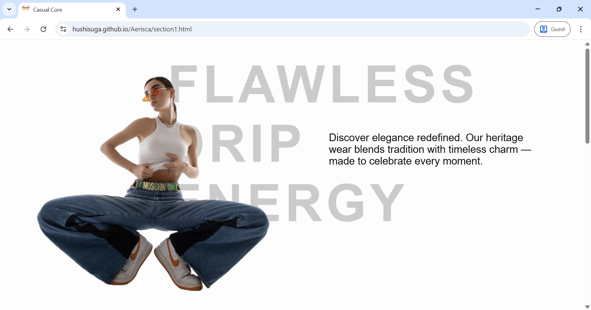
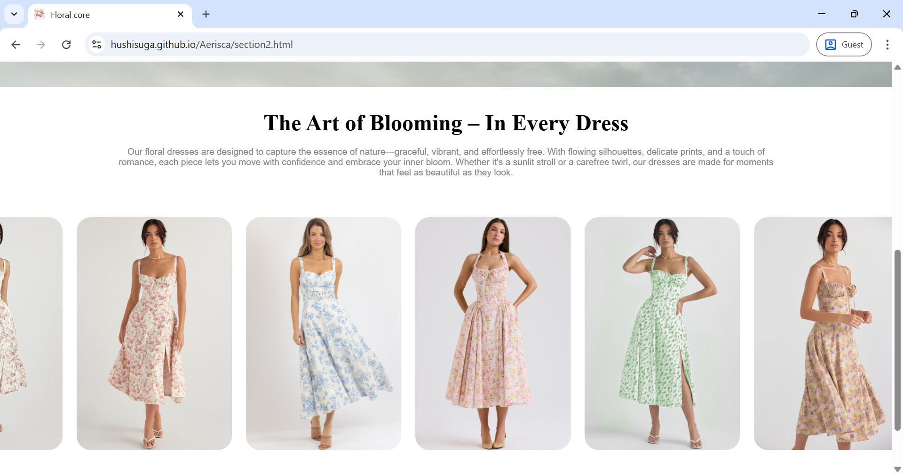
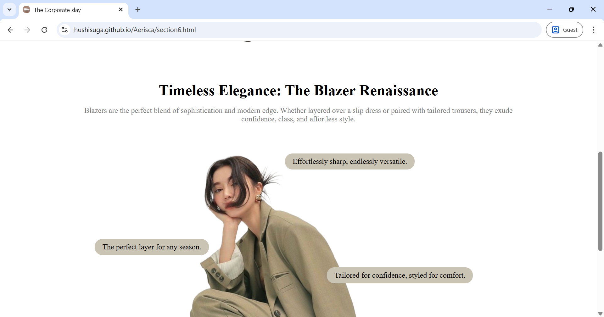
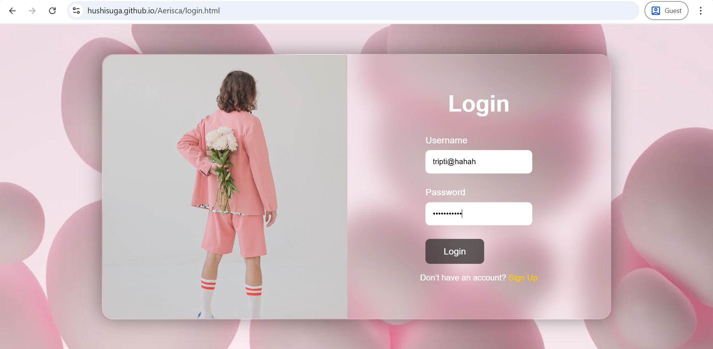
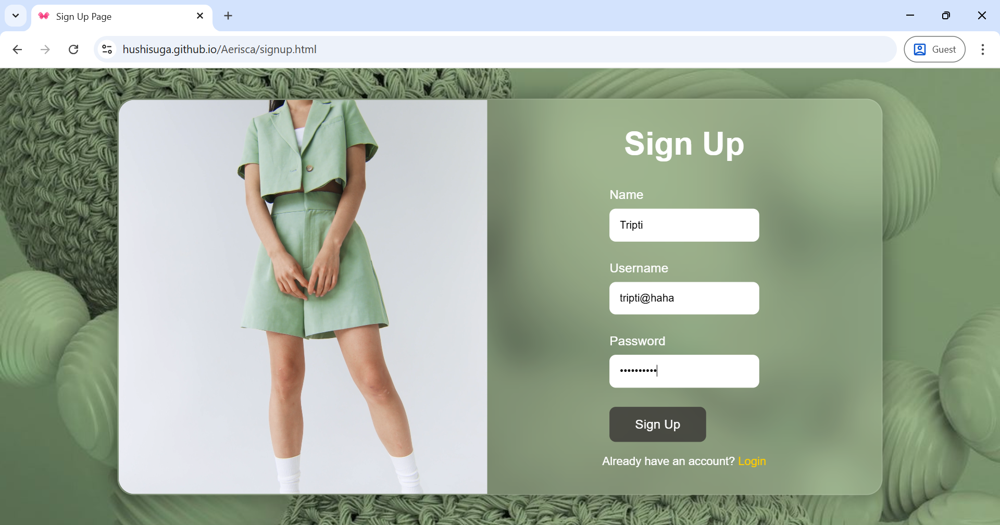

# AERISCA – Mood-Based Fashion Identity Prototype

AERISCA is a front-end fashion identity prototype that reimagines how users interact with style. Rather than using traditional categories like "tops" or "dresses," AERISCA prompts users to explore their current mood through themed fashion experiences. This project focuses on translating mood and self-expression into styled interfaces.

## Project Overview

This is a static, front-end prototype developed as a part of a personal design initiative. The goal was to create a visually engaging and concept-driven user interface that allows users to select a "vibe" and navigate to uniquely themed style pages. Each page is designed to reflect the emotion and aesthetics associated with the selected mood.

The platform is built using HTML, CSS, and JavaScript, and is currently non-responsive and without backend functionality. Future iterations may include shopping capabilities and mobile adaptation.

## Vibe-Based Categories

The main landing page prompts the user with the question: "What kind of vibe are you today?" Users can choose from the following six categories:

- Casual Core: Relaxed, comfortable, and everyday minimal style
- Floral Core: Romantic, delicate, and nature-inspired aesthetics
- Elegance Core: Sophisticated silhouettes and glam-oriented design
- Timeless Traditionals: Bridal and ethnic ensembles with cultural emphasis
- Old Money: Vintage luxury with classic and minimal elements
- Corporate Slay: Office-ready formal wear with structured designs

Each core leads to a dedicated landing page designed to match its mood with layout, visuals, and curated design elements.

## Features

- Mood-based navigation and categorization
- Unique front-end designs for each vibe
- Static, hardcoded structure suitable for showcasing UI design
- Individual aesthetic identity for each fashion core

## Built With

- HTML5  
- CSS3  
- Vanilla JavaScript

## Project Status

- User interface complete for all six fashion cores  
- Static content only; no product integration  
- No mobile responsiveness  
- No backend or form handling yet  

This project was developed as part of a college design submission and is intended as a concept prototype only.

## Screenshots and Demo

Video walkthrough and screenshots below.

[WATCH DEMO](https://drive.google.com/file/d/1KwYjK72CcFqWGn0MEx1OK2de8hpPXyXL/view?usp=sharing)

 
 ---

---

---

---

---

## Author

Designed and developed by Tripti Kumari

For inquiries, collaboration, or feedback, feel free to reach out or open an issue in this repository.

